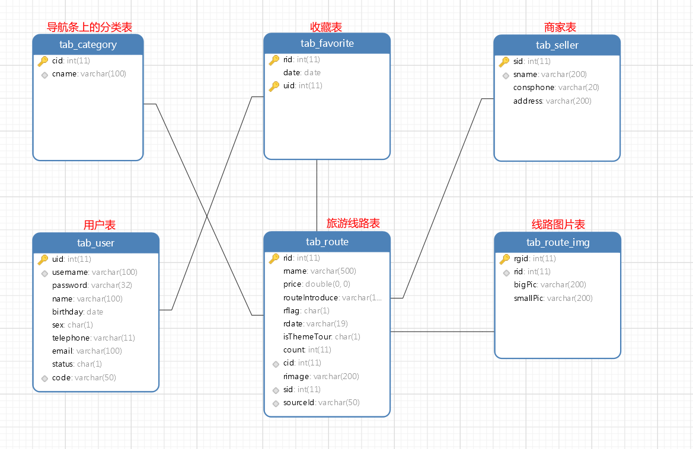

# 旅游网

## 1、主要功能

实现旅游网

## 2、主要知识点

### （1）目标

	能正确理解分析旅游网功能需求；
	能正确创建数据库和表；
	能理解并熟练搭建SSM环境；
	掌握基于SSM进行相关功能操作；
	结合以前所学能灵活综合运用到项目中；
	积累项目案例经验。

### （2）任务

```
搭建SSM环境；
完成数据库和表的创建并添加测试数据；
完成旅游网相关功能。
```

### （3）功能说明

#### 主要功能概述

```
旅游网主要有以下八大功能需求：
	登录功能；
	注册功能；
	邮件处理；
	分类数据；
	线路分页；
	线路查询；
	线路详情；
	线路收藏。
```

### （4）数据库表



### （5）功能操作

#### 环境搭建

```
导入数据库表及相关测试数据；
导入基础的素材（前端后台）。
```


### （6）项目总结

## 3、说明

### 项目中注意事项

```xml
转自：https://my.oschina.net/kkrgwbj/blog/734530
	通常我们的项目有时候是以jar包的形式发布出去，但是此时如果你直接使用lo4j2的api的话，相当于别人依赖你的jar的项目也必须加入log4j2的jar包。这样是高度耦合的。我们不建议这样使用，log4j2官方给出了适配slf4j，我们只需要在项目中加入以下依赖：
<!-- https://mvnrepository.com/artifact/org.apache.logging.log4j/log4j-slf4j-impl -->
<dependency>
    <groupId>org.apache.logging.log4j</groupId>
    <artifactId>log4j-slf4j-impl</artifactId>
    <version>2.13.3</version>
    <scope>test</scope>
</dependency>
<!-- https://mvnrepository.com/artifact/org.slf4j/slf4j-api -->
<dependency>
    <groupId>org.slf4j</groupId>
    <artifactId>slf4j-api</artifactId>
    <version>1.7.30</version>
</dependency>
```


## 4、出错

### 运行项目出错，控制台无错误输出

```xml
<!DOCTYPE mapper
  PUBLIC "-//mybatis.org//DTD Mapper 3.0//EN"
  "http://mybatis.org/dtd/mybatis-3-mapper.dtd">
<mapper namespace="com.zk.dao.UserMapper">
</mapper>
注意：namespace="com.zk.dao.UserMapper"要和包名对应，出错为namespace="com.SSM.dao.UserMapper"，而包名为"com.zk.dao.UserMapper"
```


## 5、附加

### web.xml

```xml
<?xml version="1.0" encoding="UTF-8"?>
<web-app xmlns:xsi="http://www.w3.org/2001/XMLSchema-instance"
	xmlns="http://java.sun.com/xml/ns/javaee"
	xsi:schemaLocation="http://java.sun.com/xml/ns/javaee http://java.sun.com/xml/ns/javaee/web-app_3_0.xsd"
	id="WebApp_ID" version="3.0">
	<display-name>TravelProject</display-name>
	<welcome-file-list>
		<welcome-file>index.html</welcome-file>
		<welcome-file>index.htm</welcome-file>
		<welcome-file>index.jsp</welcome-file>
		<welcome-file>default.html</welcome-file>
		<welcome-file>default.htm</welcome-file>
		<welcome-file>default.jsp</welcome-file>
	</welcome-file-list>

	<!--加载spring的配置文件 -->
	<context-param>
		<param-name>contextConfigLocation</param-name>
		<param-value>classpath:spring-config.xml</param-value>
	</context-param>
	<!--配置一个监听器 web项目一启动 就加载spring配置文件 -->
	<listener>
		<listener-class>org.springframework.web.context.ContextLoaderListener</listener-class>
	</listener>

	<!--配置前端控制器-DispatcherServlet并加载springmvc的配置文件 -->
	<servlet>
		<servlet-name>ssm</servlet-name>
		<servlet-class>org.springframework.web.servlet.DispatcherServlet</servlet-class>
		<!--初始化参数 加载springmvc配置文件 -->
		<init-param>
			<param-name>contextConfigLocation</param-name>
			<param-value>classpath:springmvc-config.xml</param-value>
		</init-param>
		<load-on-startup>1</load-on-startup>
	</servlet>
	<servlet-mapping>
		<servlet-name>ssm</servlet-name>
		<url-pattern>*.do</url-pattern>
	</servlet-mapping>

	<!--加载过滤器-字符编码处理 -->
	<filter>
		<filter-name>encoding</filter-name>
		<filter-class>org.springframework.web.filter.CharacterEncodingFilter</filter-class>
		<init-param>
			<param-name>encoding</param-name>
			<param-value>utf-8</param-value>
		</init-param>
	</filter>
	<filter-mapping>
		<filter-name>encoding</filter-name>
		<url-pattern>/*</url-pattern>
	</filter-mapping>
</web-app>
```


### MyBatis

#### 官网：https://mybatis.org/mybatis-3/

#### 中文官网：https://mybatis.org/mybatis-3/zh/index.html

#### mybatis.xml头文件：https://mybatis.org/mybatis-3/getting-started.html

```xml
<!DOCTYPE mapper
  PUBLIC "-//mybatis.org//DTD Mapper 3.0//EN"
  "http://mybatis.org/dtd/mybatis-3-mapper.dtd">
<mapper namespace="com.ssm.dao.UserMapper">

</mapper>
```

#### mybatis-config.xml头文件：https://mybatis.org/mybatis-3/getting-started.html

```xml
官网版
<?xml version="1.0" encoding="UTF-8" ?>
<!DOCTYPE configuration
  PUBLIC "-//mybatis.org//DTD Config 3.0//EN"
  "http://mybatis.org/dtd/mybatis-3-config.dtd">
<configuration>
	<environments default="development">
		<environment id="development">
			<transactionManager type="JDBC" />
			<dataSource type="POOLED">
				<property name="driver" value="${driver}" />
				<property name="url" value="${url}" />
				<property name="username" value="${username}" />
				<property name="password" value="${password}" />
			</dataSource>
		</environment>
	</environments>
	<mappers>
		<mapper resource="org/mybatis/example/BlogMapper.xml" />
	</mappers>
</configuration>


<?xml version="1.0" encoding="UTF-8"?>
<!DOCTYPE configuration
  PUBLIC "-//mybatis.org//DTD Config 3.0//EN"
  "http://mybatis.org/dtd/mybatis-3-config.dtd">
<configuration>
	<!--取别名 -->
	<typeAliases>
		<!-- <typeAlias type="com.ssm.entity.Student" alias="student"/> -->
		<!--批量设置实体类的别名,默认是类名称首字母小写 -->
		<package name="com.zk.entity" />
	</typeAliases>
	<!-- 加载mybatis分页插件PageHelper -->
	<plugins>
		<plugin interceptor="com.github.pagehelper.PageInterceptor">
			<!-- 设置数据库类型 Oracle,Mysql,MariaDB,SQLite,Hsqldb,PostgreSQL六种数据库方言，说明mysql数据库方言 -->
			<property name="helperDialect" value="mysql" />
		</plugin>
	</plugins>
	<!--映射器批量加载映射关系,告诉mybatis去哪里寻找映射关系 -->
	<mappers>
		<!-- <mapper resource="com/ssm/entity/StudentMapper.xml" /> -->
		<package name="com.zk.dao" />
	</mappers>
</configuration>
```

### Spring

#### 官网：https://spring.io/

#### Spring-Framework：https://spring.io/projects/spring-framework

#### spring-config.xml头文件

https://docs.spring.io/spring/docs/5.3.0-SNAPSHOT/spring-framework-reference/core.html#xsd-schemas-aop

```xml
<?xml version="1.0" encoding="UTF-8"?>
<beans xmlns="http://www.springframework.org/schema/beans"
	xmlns:xsi="http://www.w3.org/2001/XMLSchema-instance"
	xmlns:aop="http://www.springframework.org/schema/aop"
	xmlns:context="http://www.springframework.org/schema/context"
	xmlns:tx="http://www.springframework.org/schema/tx"
	xmlns:p="http://www.springframework.org/schema/p"
	xsi:schemaLocation="
        http://www.springframework.org/schema/beans 
        https://www.springframework.org/schema/beans/spring-beans.xsd
        http://www.springframework.org/schema/aop 
        https://www.springframework.org/schema/aop/spring-aop.xsd
        http://www.springframework.org/schema/context 
        https://www.springframework.org/schema/context/spring-context.xsd
        http://www.springframework.org/schema/tx 
        https://www.springframework.org/schema/tx/spring-tx.xsd">
        
	<!--配置数据源 -->
	<bean id="dataSource" class="com.jolbox.bonecp.BoneCPDataSource"
		p:driverClass="com.mysql.jdbc.Driver"
		p:jdbcUrl="jdbc:mysql://localhost:3306/travel" p:username="root"
		p:password="123456" />
	<!--SqlSessionFactory工厂对象 -->
	<bean id="factory"
		class="org.mybatis.spring.SqlSessionFactoryBean"
		p:dataSource-ref="dataSource"
		p:configLocation="classpath:mybatis-config.xml" />
	<!--引入映射器 -->
	<!--p:basePackage指定了批量生成映射器实例的基础包 -->
	<bean class="org.mybatis.spring.mapper.MapperScannerConfigurer"
		p:basePackage="com.zk.dao" />
	<!--配置支持注解扫描的Bean -->
	<context:component-scan base-package="com.zk" />
	<!--配置事务管理器 -->
	<bean id="txManager"
		class="org.springframework.jdbc.datasource.DataSourceTransactionManager"
		p:dataSource-ref="dataSource" />
	<!--配置支持注解 声明式事务 -->
	<tx:annotation-driven
		transaction-manager="txManager" />	
</beans>
```

#### springmvc-config.xml头文件：https://docs.spring.io/spring/docs/5.3.0-SNAPSHOT/spring-framework-reference/web.html#mvc-config

```xml
<?xml version="1.0" encoding="UTF-8"?>
<beans xmlns="http://www.springframework.org/schema/beans"
	xmlns:mvc="http://www.springframework.org/schema/mvc"
	xmlns:xsi="http://www.w3.org/2001/XMLSchema-instance"
	xmlns:context="http://www.springframework.org/schema/context"
	xmlns:p="http://www.springframework.org/schema/p"
	xsi:schemaLocation="
        http://www.springframework.org/schema/beans
        https://www.springframework.org/schema/beans/spring-beans.xsd
        http://www.springframework.org/schema/mvc
        https://www.springframework.org/schema/mvc/spring-mvc.xsd
        http://www.springframework.org/schema/context
        https://www.springframework.org/schema/context/spring-context.xsd">
    
	<!--扫描组件,作用扫描到的spring会自动帮创建对象及资源的注入 -->
	<context:component-scan
		base-package="com.zk.controller" />
	<!--配置支持注解 -->
	<mvc:annotation-driven />
	<!--配置视图解析器 -->
	<bean
		class="org.springframework.web.servlet.view.InternalResourceViewResolver"
		p:prefix="/WEB-INF/jsp/" p:suffix=".jsp" />
</beans>
```

### 用到的依赖

#### 依赖官网：

```xml
<!-- mysql依赖 -->
<!-- https://mvnrepository.com/artifact/mysql/mysql-connector-java -->
<dependency>
	<groupId>mysql</groupId>
	<artifactId>mysql-connector-java</artifactId>
	<version>5.1.48</version>
</dependency>

<!-- mybatis依赖 -->
<!-- https://mvnrepository.com/artifact/org.mybatis/mybatis -->
<dependency>
	<groupId>org.mybatis</groupId>
	<artifactId>mybatis</artifactId>
	<version>3.5.4</version>
</dependency>

<!-- mybatis-spring依赖 -->
<!-- https://mvnrepository.com/artifact/org.mybatis/mybatis-spring -->
<dependency>
	<groupId>org.mybatis</groupId>
	<artifactId>mybatis-spring</artifactId>
	<version>2.0.4</version>
</dependency>

<!-- mybatis分页插件-PageHelper -->
<!-- https://mvnrepository.com/artifact/com.github.pagehelper/pagehelper -->
<dependency>
	<groupId>com.github.pagehelper</groupId>
	<artifactId>pagehelper</artifactId>
	<version>5.1.11</version>
</dependency>

<!-- spring-webmvc依赖 -->
<!-- https://mvnrepository.com/artifact/org.springframework/spring-webmvc -->
<dependency>
	<groupId>org.springframework</groupId>
	<artifactId>spring-webmvc</artifactId>
	<version>5.2.4.RELEASE</version>
</dependency>

<!-- spring-jdbc依赖 -->
<!-- https://mvnrepository.com/artifact/org.springframework/spring-jdbc -->
<dependency>
	<groupId>org.springframework</groupId>
	<artifactId>spring-jdbc</artifactId>
	<version>5.2.4.RELEASE</version>
</dependency>

<!-- bonecp依赖 -->
<!-- https://mvnrepository.com/artifact/com.jolbox/bonecp -->
<dependency>
	<groupId>com.jolbox</groupId>
	<artifactId>bonecp</artifactId>
	<version>0.8.0.RELEASE</version>
</dependency>

<!-- Jstl依赖 -->
<!-- https://mvnrepository.com/artifact/javax.servlet/jstl -->
<dependency>
	<groupId>javax.servlet</groupId>
	<artifactId>jstl</artifactId>
	<version>1.2</version>
</dependency>

<!-- Log4J2依赖 -->
<!-- https://logging.apache.org/log4j/2.x/maven-artifacts.html -->
<dependency>
	<groupId>org.apache.logging.log4j</groupId>
	<artifactId>log4j-api</artifactId>
	<version>2.13.3</version>
</dependency>
<dependency>
	<groupId>org.apache.logging.log4j</groupId>
	<artifactId>log4j-core</artifactId>
	<version>2.13.3</version>
</dependency>
<!-- https://mvnrepository.com/artifact/org.apache.logging.log4j/log4j-slf4j-impl -->
<dependency>
    <groupId>org.apache.logging.log4j</groupId>
    <artifactId>log4j-slf4j-impl</artifactId>
    <version>2.13.3</version>
    <scope>test</scope>
</dependency>
<!-- https://mvnrepository.com/artifact/org.slf4j/slf4j-api -->
<dependency>
    <groupId>org.slf4j</groupId>
    <artifactId>slf4j-api</artifactId>
    <version>1.7.30</version>
</dependency>

<!-- jackson-databind依赖 -->
<!-- https://mvnrepository.com/artifact/com.fasterxml.jackson.core/jackson-databind -->
<dependency>
	<groupId>com.fasterxml.jackson.core</groupId>
	<artifactId>jackson-databind</artifactId>
	<version>2.10.0</version>
</dependency>

<!-- javax.mail依赖 -->
<!-- https://mvnrepository.com/artifact/javax.mail/javax.mail-api -->
<dependency>
	<groupId>javax.mail</groupId>
	<artifactId>javax.mail-api</artifactId>
	<version>1.6.2</version>
</dependency>
<!-- https://mvnrepository.com/artifact/com.sun.mail/javax.mail -->
<dependency>
	<groupId>com.sun.mail</groupId>
	<artifactId>javax.mail</artifactId>
	<version>1.6.2</version>
</dependency>
```

